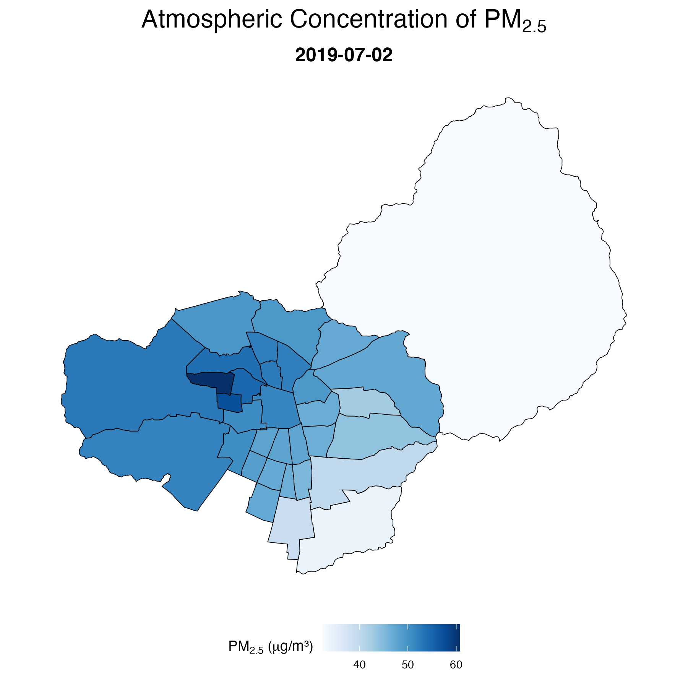
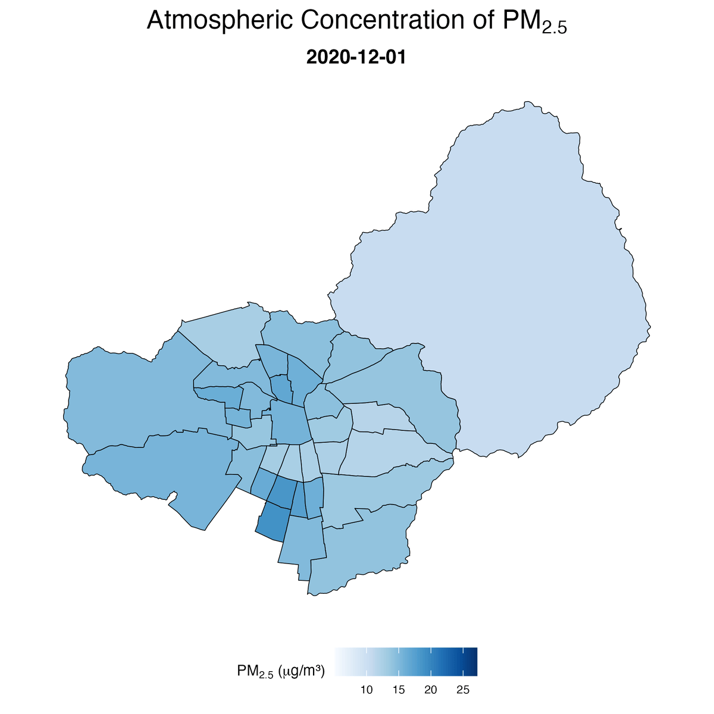
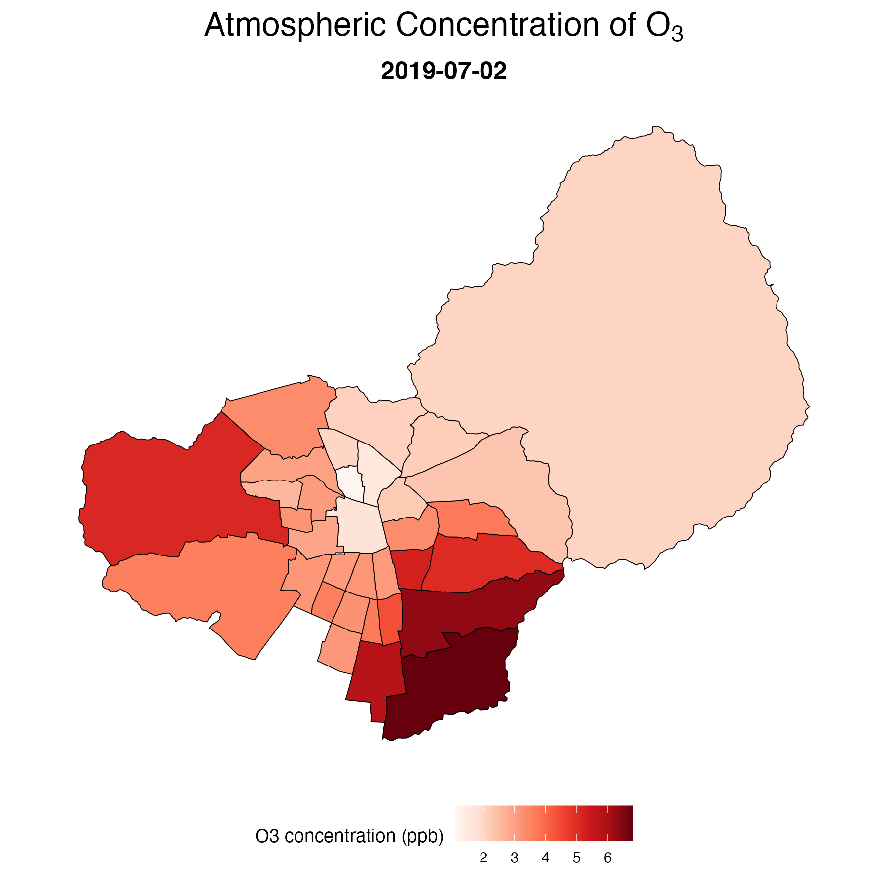
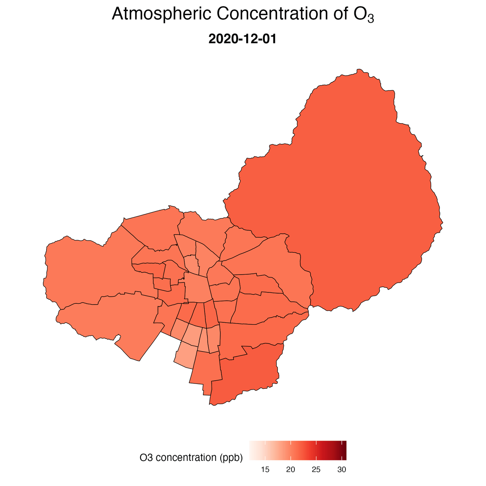
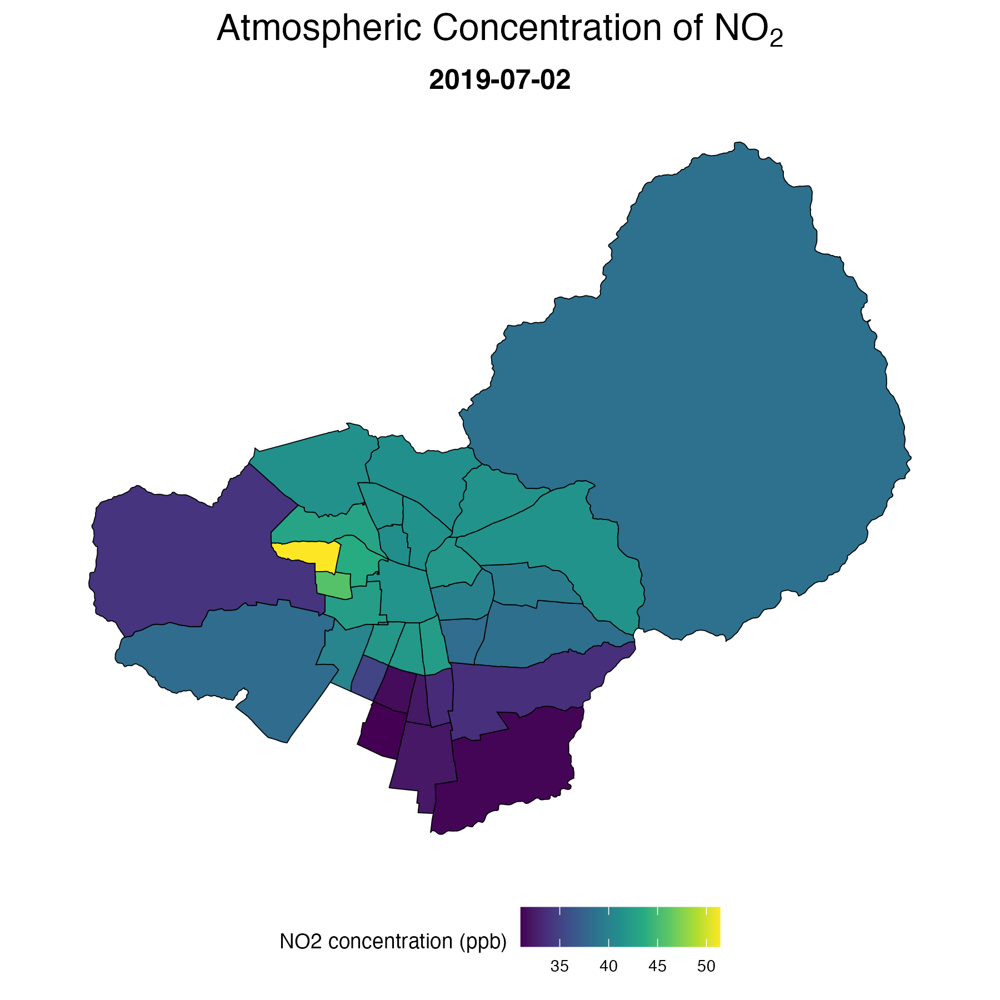
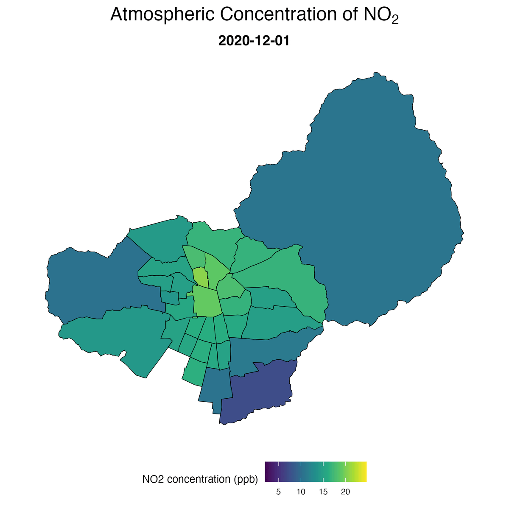

# Spatial Interpolation and Visualization Framework for Air Pollution Using Ordinary Kriging and Inverse Distance Weighting


## Overview

Accurate spatial estimation of atmospheric pollutants is essential for environmental epidemiology, urban health research, and public policy analysis, particularly in settings where monitoring stations are spatially sparse or unevenly distributed. This repository provides an integrated and reproducible R-based framework for the spatial interpolation and visualization of air pollution data using two complementary methodologies: Ordinary Kriging (OK) and Inverse Distance Weighting (IDW). The workflow was developed to generate daily municipality-level estimates of PM2.5, O3, and NO2 from observations obtained through Chile’s National Air Quality Information System (SINCA).

The interpolation pipeline incorporates automated variogram fitting, kriging variance estimation, and confidence interval generation, while supporting customizable interpolation parameters and memory-efficient yearly processing. In addition to spatial prediction, the framework includes visualization tools for producing publication-ready interpolation maps and animated GIFs that display temporal changes in pollutant concentrations across user-defined date ranges.

The repository was designed to support research on climate change, urban environments, and maternal-child health, particularly studies evaluating the relationship between air pollution exposure and adverse birth outcomes in Santiago, Chile. By integrating interpolation and visualization into a unified workflow, this framework facilitates reproducible environmental exposure assessment for epidemiological and geospatial analyses.

## Authors and Contact

:mailbox: Estela Blanco (<estela.blanco@uc.cl>) - **Principal Investigator**

:mailbox_with_mail: Ismael Bravo (<ismael.bravo.rodriguez@gmail.com>) - **Principal Investigator  - Repository Manager**

:mailbox: Felipe Cornejo (<fel.cornejo.n@gmail.com>) -  **Principal Investigator**

:mailbox: José Daniel Conejeros (<jdconejeros@uc.cl>) - **Research Collaborator**

## Funding

**FONDECYT Initiation Research Grant Nº 11240322**: *Climate change and urban health: how air pollution, temperature, and city structure relate to preterm birth*. Project funded by the National Agency for Research and Development (ANID) through the FONDECYT Initiation program, and led by Estela Blanco.

**FONDECYT Regular Research Grant Nº 1241477**: *High Spatial and Temporal Resolution Model for Estimation of Local and Global Emissions Generated by the Transportation Sector in Chile, 2015–2050*. Project funded by the National Agency for Research and Development (ANID) through the FONDECYT Regular program, and led by Mauricio Osses.

## Objective

The objective of this repository is to provide a reproducible and customizable framework for the spatial interpolation and visualization of atmospheric pollutants (PM2.5, O3, and NO2) at the municipality level. By integrating Ordinary Kriging (OK) and Inverse Distance Weighting (IDW) methodologies into a unified workflow, the repository aims to facilitate the generation of daily spatially continuous estimates of PM2.5, O3, and NO2 from monitoring station observations. In addition to spatial prediction, the framework was designed to support visualization and exploratory analysis through the automated generation of interpolation maps and animated spatiotemporal representations of pollutant dynamics. Ultimately, this repository seeks to support environmental epidemiology, urban health, and climate-related research requiring high-resolution air pollution exposure assessment in Santiago, Chile.

<p align="center">
  
</p>

<p align="center">
  <b>Figure 1.</b> Left: Location and names of the SINCA monitoring network stations (red dots). Right: Location of monitoring stations with observed values (red dots) and municipal administration buildings to be interpolated (blue crosses).
</p>

## Methods

### Data Source and Pollutants

Daily air pollution observations were obtained from Chile’s National Air Quality Information System (SINCA). The interpolation framework was developed for three atmospheric pollutants:

- Fine particulate matter (PM2.5)
- Ozone (O3)
- Nitrogen dioxide (NO2)

Input monitoring series were pre-imputed prior to interpolation using previously generated imputed datasets.

The spatial framework relies on the following geospatial inputs:

- SINCA imputed series ([`Data/imputed_series.RData`](Data/imputed_series.RData)) containing daily monitoring station observations as `sf` objects.
- Municipal administration building locations ([`Data/interpolation_locations.RData`](Data/interpolation_locations.RData)), used as interpolation targets.
- Santiago municipality shapefiles ([`Data/municipalities_shape.RData`](Data/municipalities_shape.RData)) for spatial visualization and boundary definition.

### Spatial Interpolation Approaches

Two complementary spatial interpolation methodologies were implemented:

- **Inverse Distance Weighting (IDW)** as a deterministic interpolation method using the `gstat` package.
- **Ordinary Kriging (OK)** as a stochastic geostatistical interpolation method with automatic empirical variogram fitting implemented through the `automap` package.

### Spatial Framework

Monitoring stations and municipal administration building locations were transformed from geographic coordinates (EPSG:4326) to UTM Zone 19S (EPSG:32719) to enable distance-based interpolation in meters. Daily municipality-level pollutant estimates were generated from observed monitoring station concentrations.

### Interpolation Parameters

Core interpolation parameters are fully customizable within the interpolation functions.

#### Inverse Distance Weighting (IDW)

- Distance decay power (`idp`) = 2
- Maximum neighboring stations (`nmax`) = 5
- Maximum search radius (`maxdist`) = 15 km

#### Ordinary Kriging (OK)

- Minimum observations required (`ok_nmin`) = 3
- Automatic empirical variogram fitting using `automap`
- Confidence intervals generated from kriging variance estimates (`conf_level` = 0.95)

### Temporal Structure

Interpolation is performed independently for each date in the time series. To improve computational efficiency and memory management, the workflow iterates interpolation separately by year and pollutant before reconstructing the final dataset.

### Interpolation Workflow Functions

The interpolation pipeline is primarily organized around two core functions:

- `interpolate_spatial(...)`
  - Performs daily spatial interpolation using IDW, Ordinary Kriging, or both simultaneously.
  - Returns predicted concentrations, kriging variances, and confidence intervals.

- `interp_save_year(...)`
  - Iterates interpolation by year and pollutant.
  - Saves yearly interpolation outputs as temporary `.RData` files for later reconstruction.

### Visualization Framework

The repository also includes a visualization workflow for generating publication-ready interpolation maps and animated GIFs.

Main visualization functions:

- `graficar_interpolacion(...)`
  - Generates customizable interpolation maps for user-defined dates.
  - Supports visualization of IDW predictions, OK predictions, kriging variance, and confidence intervals.

- `gif_interpolacion(...)`
  - Produces animated GIFs over user-defined temporal windows.
  - Maintains a fixed global color scale across all animation frames.

### Software and Main R Packages

The framework was implemented in R using the following main packages:

- `sf`
- `sp`
- `gstat`
- `automap`
- `tidyverse`
- `lubridate`
- `gifski`
- `viridisLite`
- `RColorBrewer`
- `scales`

### Technical Notes and Methodological Considerations

Although the workflow primarily relies on the modern `sf` spatial framework, certain interpolation steps make use of `sp` objects to ensure compatibility with the automatic variogram fitting procedures implemented in the `automap` package. In particular, the `autofitVariogram()` function requires objects of class `sp`, which justifies this temporary conversion within the pipeline.

The interpolation framework was originally designed to produce municipality-level aggregated exposure estimates. For this reason, pollutant concentrations are interpolated at a single representative location per municipality, specifically the municipal administration building, which in many cases is considered more representative of urban exposure conditions than simple geometric centroids. However, the workflow remains fully generalizable and can be applied to alternative spatial supports, including regular raster grids or any user-defined set of prediction locations.

## Repository Structure

```text
Pollution_Interpolation_Kriging_IDW
│
├── Code/
│   ├── 1_interpolation.R               # Spatial interpolation workflow
│   └── 2_visualization.R               # Static maps and animated GIF generation
│
├── Data/
│   ├── imputed_series.RData            # Imputed daily monitoring station observations (sf object)
│   ├── interpolation_locations.RData   # Municipality/building interpolation targets (sf object)
│   └── municipalities_shape.RData      # Municipality polygon shapefile (sf object)
│
├── Figures/                            # Example figures and GIF outputs
│
├── Output/
│   └── interpolated_series.RData       # Final municipality-level interpolation dataset
│
└── README.md
```
## Result

### Interpolated Dataset

The interpolation workflow generates daily municipality-level pollutant concentrations for PM2.5, O3, and NO2, stored in [`Output/interpolated_series.RData`](Output/interpolated_series.RData).

For each pollutant and date, the output dataset includes:

- `*_idw_pred`: Estimated pollutant concentration using Inverse Distance Weighting (IDW)
- `*_ok_pred`: Predicted concentration using Ordinary Kriging (OK)
- `*_ok_var`: Variance for OK predictions
- `*_ok_lci`: Lower bound of the confidence interval for OK predictions
- `*_ok_uci`: Upper bound of the confidence interval for OK predictions  

These outputs provide both deterministic (IDW) and geostatistical (OK) estimates, allowing uncertainty-aware exposure assessment.

### Visualization Outputs

The visualization pipeline generates publication-ready spatial maps and animated temporal sequences from the interpolated dataset.

Generated figures include:

- Static interpolation maps for selected dates
- Animated GIFs showing temporal evolution over user-defined periods

Outputs are fully customizable in terms of:

- **Pollutant type** (PM2.5, O3, NO2)
- **Interpolation method displayed** (IDW or Ordinary Kriging)
- **Temporal specification** (single dates or date ranges)
- **Color palettes and scaling** (viridis, Blues, Reds; fixed or dynamic ranges)
- **Map display options** (axis visibility and layout for publication)
- **Export settings** (PNG maps and GIF animations with user-defined paths and filenames)
- **Animation speed** (frames per second)

### Example

<p align="center">
  
  
  
  
</p>

<p align="center">
  <b>Figure 2.</b> PM2.5 interpolation results. Static maps: Ordinary Kriging (OK) and IDW for 2019-07-02. Animated outputs show temporal evolution during a user-defined period (December 2020).
</p>

<p align="center">
  
  
  
  
</p>

<p align="center">
  <b>Figure 3.</b> Ozone (O3) interpolation results. Static maps and animated temporal evolution using OK and IDW methods.
</p>

<p align="center">
  
  
  
  
</p>

<p align="center">
  <b>Figure 4.</b> Nitrogen dioxide (NO2) interpolation results. Static maps and animated temporal evolution using OK and IDW methods.
</p>

## Acknowledgements

We acknowledge data from the Chilean National Air Quality Information System (SINCA) — [SINCA](https://sinca.mma.gob.cl/).

