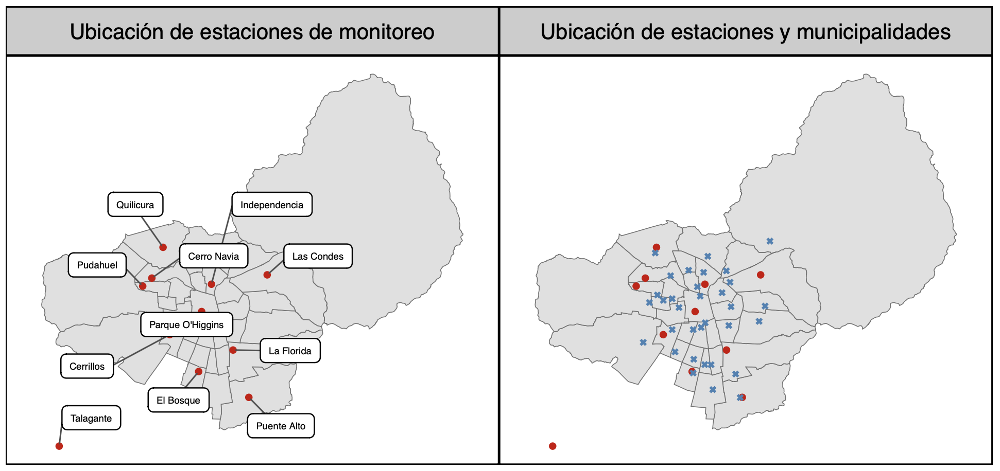
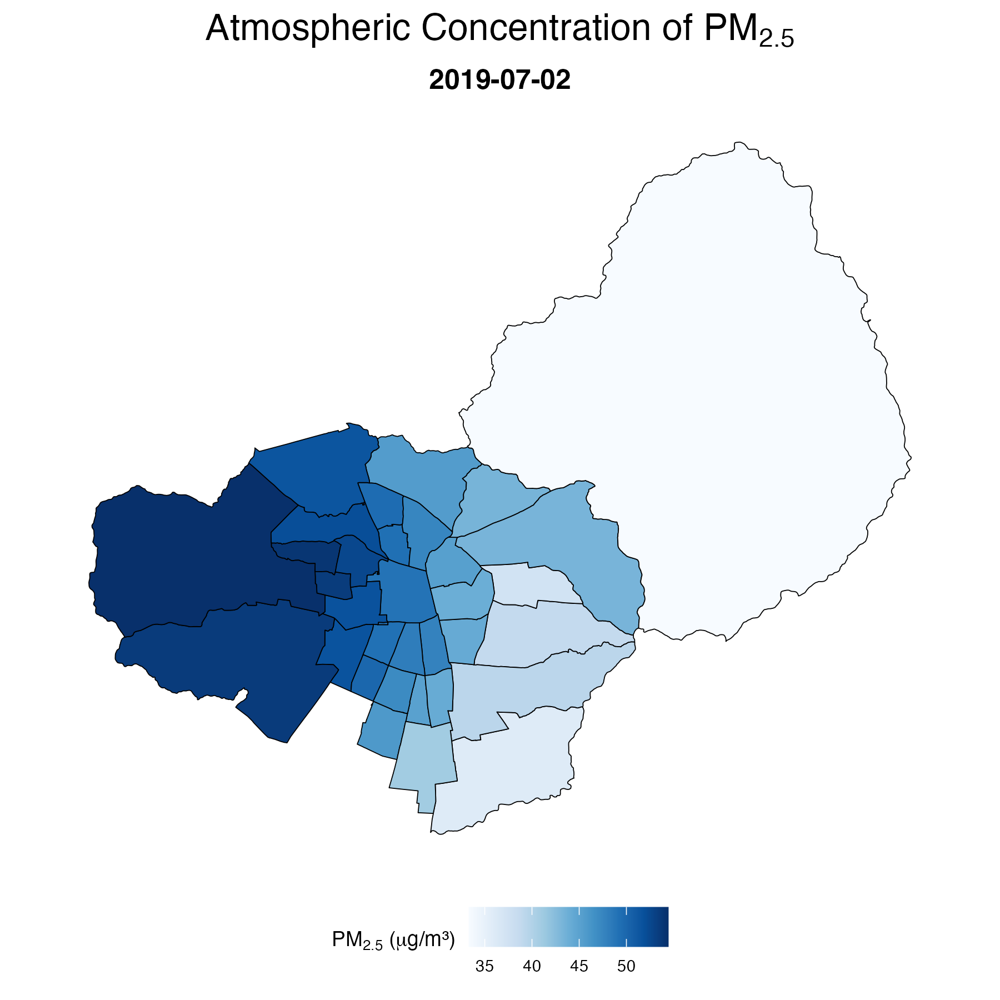
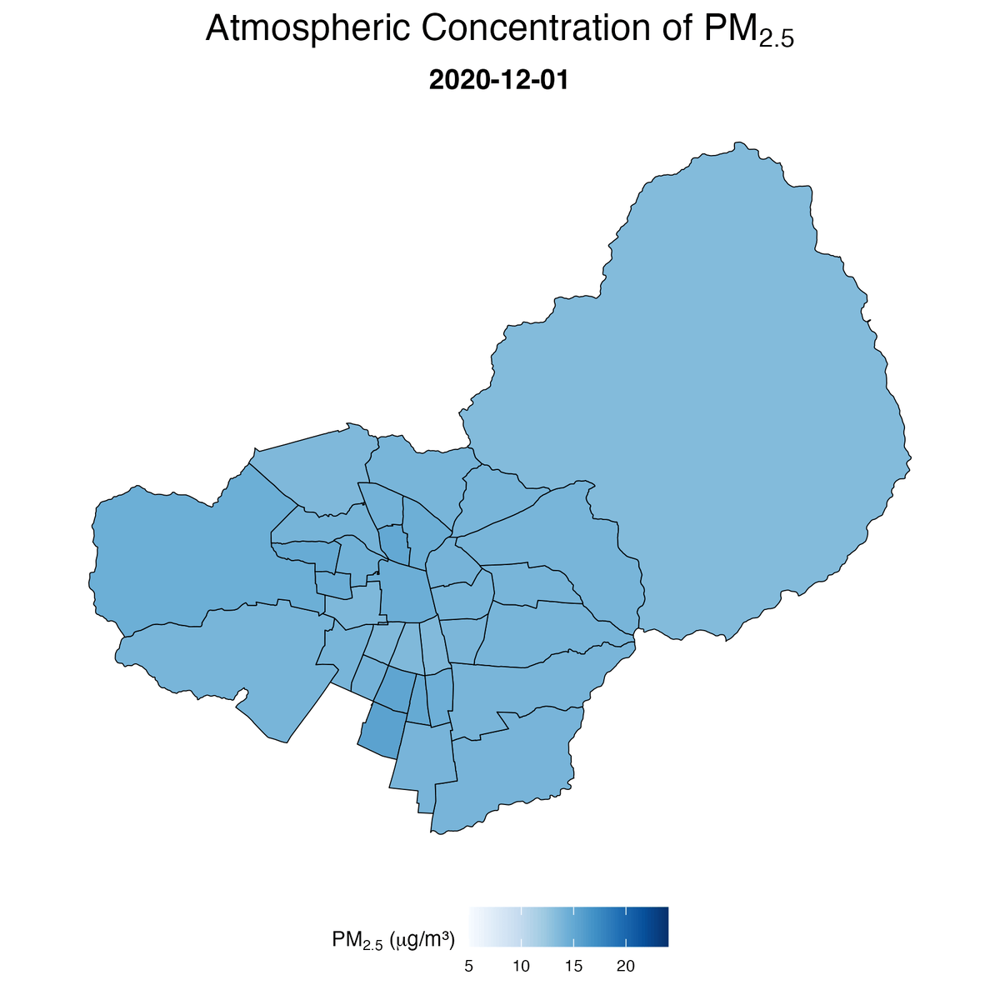
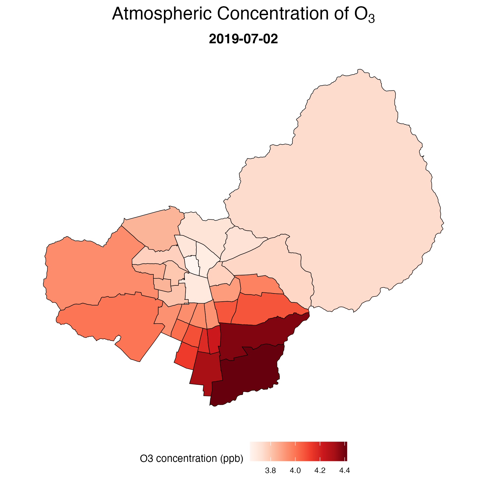
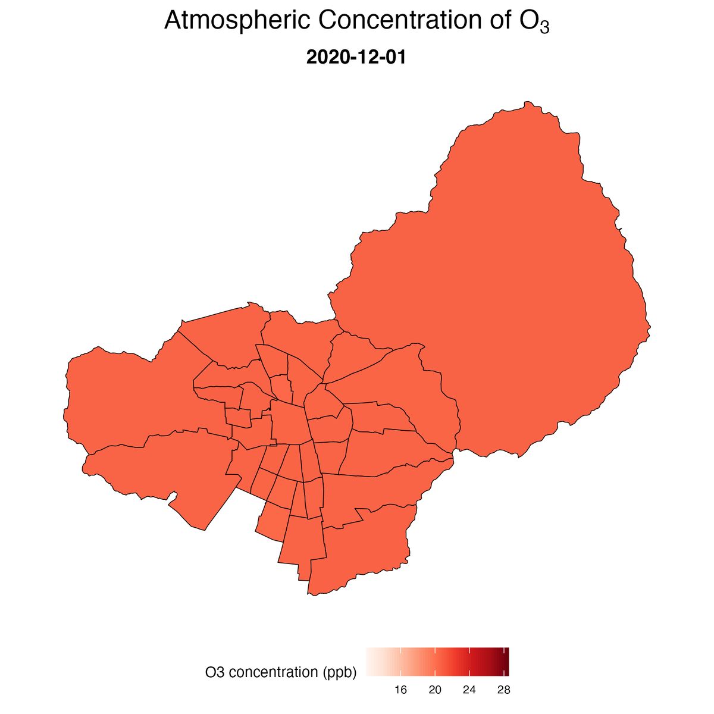
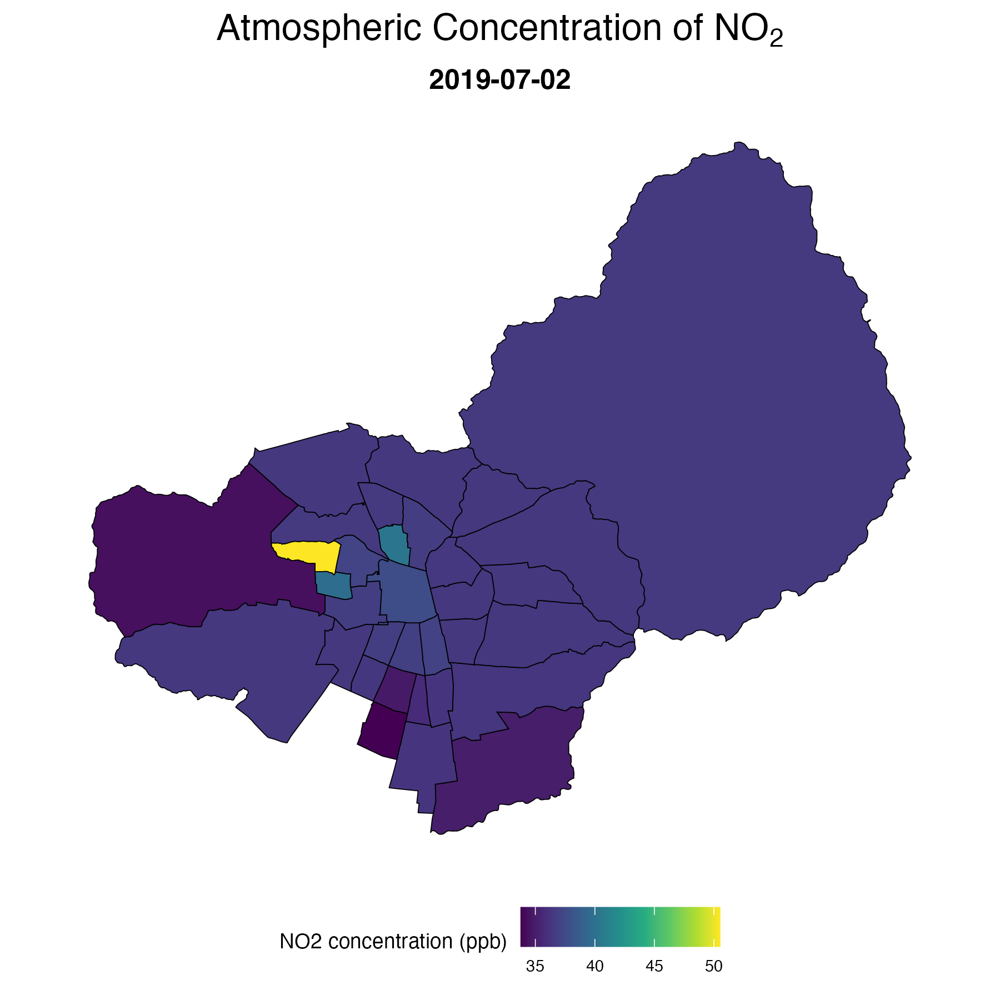
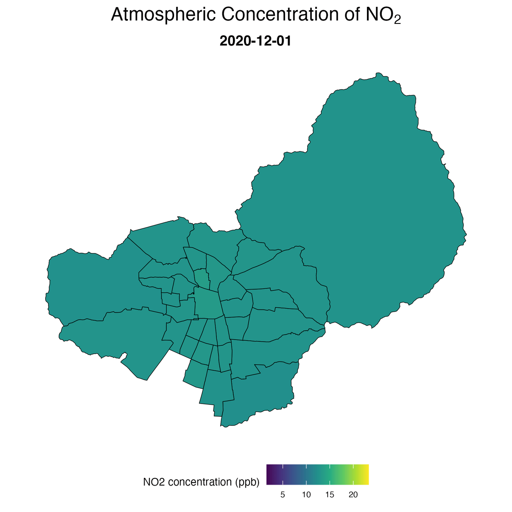

# Integrated Spatial Interpolation and Visualization Framework for Atmospheric Pollution using Ordinary Kriging and Inverse Distance Weighting Methods

## Abstract

COMPLETE

## Research Team and Conctact

:mailbox: Estela Blanco (<estela.blanco@uc.cl>) - **Principal Investigator**

:mailbox_with_mail: Ismael Bravo (<ismael.bravo.rodriguez@gmail.com>) - **Principal Investigator  - Repository Manager**

:mailbox: Felipe Cornejo (<fel.cornejo.n@gmail.com>) -  **Principal Investigator**

:mailbox: José Daniel Conejeros (<jdconejeros@uc.cl>) - **Research Collaborator**

## Funding

**FONDECYT Initiation Research Grant Nº 11240322**: *Climate change and urban health: how air pollution, temperature, and city structure relate to preterm birth*. Project funded by the National Agency for Research and Development (ANID) through the FONDECYT Initiation program, and led by Estela Blanco.

## Background

Epidemiologic and policy analyses often require spatially complete estimates of air pollution exposure; however, monitoring stations are often unevenly distributed across space. To address this limitation, we apply both stochastic and deterministic spatial interpolation methods—Ordinary Kriging (OK) and Inverse Distance Weighting (IDW), respectively—to generate daily municipality-level estimates of PM2.5, O3, and NO2 based on observed concentrations from monitoring stations of the National Air Quality Information System (SINCA).

  

  <b>Figure 1.</b> Left: Location and names of the SINCA monitoring network stations (red dots). Right: Location of monitoring stations with observed values (red dots) and municipal administration buildings to be interpolated (blue crosses).

## Objective

COMPLETE

## Methods

- **Data source**: Daily pollutant concentrations from Chile’s National Air Quality Information System (SINCA). See [SINCA – Sistema de Información Nacional de Calidad del Aire](https://sinca.mma.gob.cl/).
- **Pollutants interpolated**: Fine particulate matter (PM2.5), ozone (O3), and nitrogen dioxide (NO2).
- **Interpolation approaches**:
  - **Inverse Distance Weighting (IDW)** as a deterministic interpolation (`gstat` package).
  - **Ordinary Kriging (OK)** as a stochastic geostatistical interpolation method with automatic variogram fitting (`automap` package).
- **Spatial framework**:
  - Monitoring stations and municipal administration building locations are transformed from geographic coordinates (EPSG:4326) to UTM Zone 19S (EPSG:32719) to enable distance-based interpolation in meters.
  - Daily municipality-level pollutant estimates are generated from monitoring station observations.
- **Core interpolation parameters** (fully customizable within the interpolation function):
  - **IDW**
    - Distance decay power (`idp`) = 2
    - Maximum neighboring stations (`nmax`) = 5
    - Maximum search radius (`maxdist`) = 15 km
  - **Ordinary Kriging**
    - Minimum observations required (`ok_nmin`) = 3
    - Automatic empirical variogram fitting implemented with the `automap` package
    - Confidence intervals generated from kriging variance estimates (`conf_level` = 0.95)
- **Temporal structure**:
  - Interpolation is performed independently for each date in the time series.
  - The workflow iterates yearly to improve memory efficiency and computational performance.
- **Missingness**:
  - Input monitoring series are pre-imputed before interpolation using previously generated imputed datasets.

Key functions implemented in the interpolation workflow:

- `interpolate_spatial(...)`:
  - Performs daily spatial interpolation using IDW, Ordinary Kriging, or both simultaneously.
  - Returns predicted concentrations, kriging variances, and confidence intervals.
- `interp_save_year(...)`:
  - Iterates interpolation by year and pollutant.
  - Saves yearly interpolation outputs as temporary `.RData` files for later reconstruction.

Software and main R packages:

- R
- `sf`
- `sp`
- `gstat`
- `automap`
- `tidyverse`
- `dplyr`
- `tidyr`
- `lubridate`
- `readxl`

## Code

COMPLETE (ADD STRUCTURE)

## Input

- Imputed series
- Municipal administration building locationes
- shape

## Output

- Daily municipality-level interpolated concentrations for:
  - PM2.5
  - O3
  - NO2
- Prediction outputs include:
  - IDW predictions
  - Ordinary Kriging predictions
  - Kriging variance
  - Lower and upper confidence intervals

## Example Figures

  
  

  <b>Figure 2.</b> Left: OK interpolation of PM2.5 for 2019-07-02. Right: Animated GIF showing the PM2.5 interpolation for December 2020. 

  
  

  <b>Figure 3.</b> Left: OK interpolation of O3 for 2019-07-02. Right: Animated GIF showing the O3 interpolation for December 2020.

  
  

  <b>Figure 4.</b> Left: OK interpolation of NO2 for 2019-07-02. Right: Animated GIF showing the NO2 interpolation for December 2020.

## Acknowledgements

We acknowledge data from the Chilean National Air Quality Information System (SINCA) — [SINCA](https://sinca.mma.gob.cl/).

